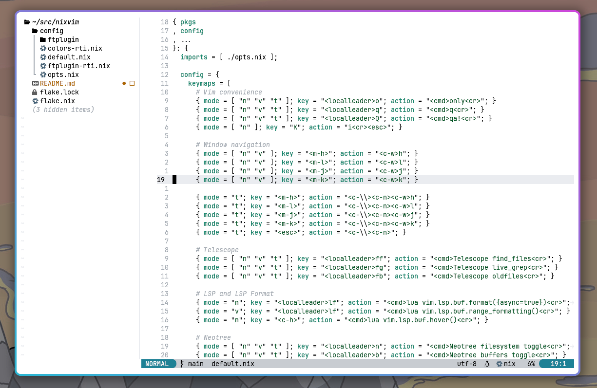

# neovim.nix

[Neovim](https://neovim.io/) configuration [flake](https://nix.dev/manual/nix/2.24/command-ref/new-cli/nix3-flake.html) based on [nixvim](https://github.com/nix-community/nixvim).

<p align="center">
  
</p>


```
nix run github:rti/neovim.nix
```
